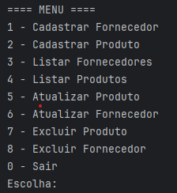
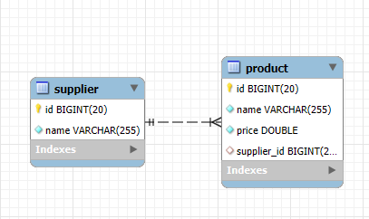

# Sistema de Gerenciamento de Fornecedores e Produtos

Este projeto é um sistema simples de cadastro e gerenciamento de fornecedores e produtos para o trabalho da matéria **Desevolvimento Baseado em Padrões e Frameworks**, desenvolvido utilizando **Java com Hibernate (apenas Hibernate, sem frameworks adicionais)** para persistência de dados em banco de dados relacional.

## 🏗️ Tecnologias utilizadas

- Java
- Hibernate ORM
- MySQL
- Maven

## Menu via Terminal

## 📜 Funcionalidades

O sistema é baseado em um menu no terminal, com as seguintes opções:

- **Cadastrar Fornecedor:** Insere um novo fornecedor no banco de dados.
- **Cadastrar Produto:** Insere um novo produto no banco de dados, associado a um fornecedor.
- **Listar Fornecedores:** Exibe todos os fornecedores cadastrados.
- **Listar Produtos:** Exibe todos os produtos cadastrados, incluindo seus respectivos fornecedores.
- **Atualizar Produto:** Permite alterar o **nome** de um produto existente.
- **Atualizar Fornecedor:** Permite alterar o **nome** de um fornecedor existente.
- **Excluir Produto:** Remove um produto do banco de dados.
- **Excluir Fornecedor:** Remove um fornecedor do banco de dados (atenção: é necessário remover os produtos associados antes).

### 🧩 Entidades

Este projeto foi feito de forma simples, as classes são simples, apenas para fins de demonstração e conforme solicitado no trabalho.

### 💡 Relacionamento

- Um **Fornecedor** pode estar relacionado a **muitos Produtos**.
- Um **Produto** pertence a **um único Fornecedor**.

## 🔒 Validações

O sistema possui validações básicas para garantir a integridade dos dados:

- **Não é permitido cadastrar dois fornecedores com o mesmo nome.**
- **Não é permitido cadastrar dois produtos com o mesmo nome. (mesmo que de fornecedores diferentes)**

Caso tente cadastrar um produto ou fornecedor com um nome já existente no banco de dados, o sistema exibirá uma mensagem informando que o nome já está cadastrado.

## 🔧 Configuração do Banco de Dados

O sistema realiza a **criação automática do banco de dados e das tabelas**

Usuário: root

Senha: 123456

